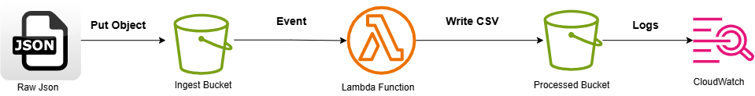

# 📦 Automated Serverless Pipeline

A fully automated, event‑driven serverless pipeline that ingests raw JSON data, transforms it into normalized CSV tables, and stores the results in S3 — all provisioned with Terraform and validated with a complete pytest suite.

This project demonstrates real platform engineering practices: infrastructure‑as‑code, event‑driven compute, structured logging, modular Python design, and automated testing.

---

# 📖 Overview

## ✅ What this project solves

Data ingestion and transformation workflows are often:

- manual
- inconsistent
- hard to reproduce
- difficult to monitor

This pipeline provides a repeatable, automated, serverless pattern for:

- ingesting raw data
- triggering compute automatically
- transforming data into normalized tables
- storing processed outputs
- monitoring execution with structured logs

## ✅ Why this exists

This project is a hands‑on demonstration of:

- AWS serverless architecture
- Terraform module usage
- Python Lambda best practices
- Structured CloudWatch logging
- Automated testing with pytest
- Real‑world pipeline design

It serves as a portfolio‑ready example of platform engineering skills.

---

# 🏗️ Architecture

_High‑level architecture of the automated serverless pipeline._

## Logging & Monitoring

- Structured JSON logs
- Correlation IDs (`aws_request_id`)
- CloudWatch Insights‑friendly events
- Error classification via custom exception hierarchy

---

# 🛠 Tech Stack

### Infrastructure

- Terraform (S3, Lambda, IAM, event notifications)
- AWS Cloud (S3, Lambda, CloudWatch)

### Application

- Python 3.9+
- Modular Lambda code (`lambda_function/`)
- Custom error hierarchy
- Structured logging

### Tooling

- pytest for unit tests
- Makefile for automation
- Bash scripts for orchestration

---

# 📂 Project Structure

      automated-serverless-pipeline/
      ├── data/                     # Sample input data
      ├── docs/                     # Architecture & design notes
      ├── examples/                 # Example usage scripts
      ├── lambda_function/          # Lambda application code
      │   ├── config.py
      │   ├── errors.py
      │   ├── index.py
      │   ├── s3_utils.py
      │   └── transform.py
      ├── scripts/                  # Operational scripts
      ├── src/                      # Local utilities (data generation)
      ├── terraform/                # IaC for AWS resources
      ├── tests/                    # pytest suite
      ├── Makefile                  # Automation commands
      └── requirements.txt

---

# 🚀 Getting Started

## 1. Prerequisites

- AWS CLI configured
- Terraform v1.5+
- Python 3.9+
- Make (optional but recommended)

## 2. Install dependencies

      pip install -r requirements.txt

## 3. Deploy infrastructure

      make deploy-infra

## 4. Run the pipeline

      make run-pipeline

## 5. Monitor logs

      make monitor

---

# 🔍 How the Lambda Works

## ✅ 1. Event Parsing

Extracts bucket + key from the S3 event.

## ✅ 2. S3 Read

Reads raw JSON using `read_from_s3`.

## ✅ 3. Transformation

`transform_data()`:

- validates schema
- normalizes orders → orders.csv
- extracts customers → customers.csv
- expands items → items.csv

## ✅ 4. S3 Write

Each CSV is written to:

      processed/<table>.csv

## ✅ 5. Structured Logging

Every log entry includes:

- `event` name
- `request_id`
- contextual metadata

Example:

      {
        "event": "TRANSFORM_SUCCESS",
        "request_id": "abc-123",
        "tables": ["orders", "customers", "items"]
      }

---

# 🧪 Testing

Run the full test suite:

      pytest -q

Tests include:

- `test_transform.py` — schema validation, CSV output
- `test_s3_utils.py` — S3 read/write with mocks
- `test_index.py` — Lambda handler behavior
- `test_generate_data.py` — data generation utility

---

# 📊 Monitoring & Troubleshooting

## View logs

      aws logs tail /aws/lambda/<function-name> --follow

## Common issues

| Issue                | Likely Cause                 | Fix                          |
| -------------------- | ---------------------------- | ---------------------------- |
| AccessDenied         | IAM role missing permissions | Check Terraform IAM policies |
| No output files      | Transform error              | Check CloudWatch logs        |
| Lambda not triggered | S3 event misconfigured       | Re‑apply Terraform           |

---

# 📈 Future Enhancements

- CI/CD pipeline (GitHub Actions or CodePipeline)
- Support multiple data sources
- Add DynamoDB or Athena for downstream analytics
- Add cost monitoring + tagging

---

# 📜 License

MIT License — see [`LICENSE`](../LICENSE) for details.

---

# 🙌 Acknowledgements

This project is built as a hands‑on platform engineering exercise, combining AWS, Terraform, Python, and automated testing into a cohesive, production‑style workflow.
