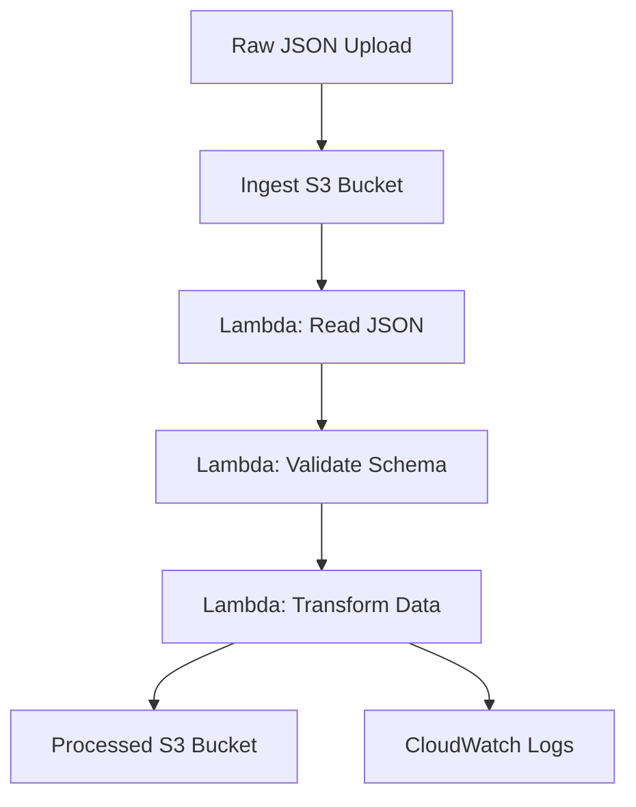

# 🧩 Internal Engineering Documentation

A deeper, engineering‑focused look at the architecture, decisions, workflows, and reasoning behind the Automated Serverless Pipeline project.  
This document complements the top‑level README by explaining **how** the system works and **why** it was built this way.

---

# 📐 Architecture (Engineering View)

This pipeline implements a simple but production‑aligned serverless ingestion and transformation workflow:

1. **Raw JSON** is uploaded to the **ingest S3 bucket**.
2. An **S3 Event Notification** triggers the Lambda function.
3. Lambda:
   - reads the raw JSON
   - validates the schema
   - normalizes it into three tabular datasets
   - writes `orders.csv`, `customers.csv`, and `items.csv` to the **processed S3 bucket**
4. CloudWatch captures structured logs for observability.

## Mermaid Diagram



---

# 🧠 Engineering Decisions

This project maintains a full decision log in `docs/decisions.md`.  
Below is a high‑level summary of the most impactful choices:

### ✅ Tagging via `locals` instead of provider‑level `default_tags`

- Explicit, portable, multi‑provider‑friendly
- Easier to audit and override

### ✅ Removed networking from the root module

- Lambda + S3 + CloudWatch do not require VPC networking
- Reduces cost, complexity, and cold‑start latency

### ✅ Introduced a Python data generator

- Ensures reproducible test payloads
- Enables rapid iteration without manual JSON crafting

### ✅ Restructured Lambda directory

- Clear separation of concerns (`handlers/`, `utils/`, `models/`, `config/`)
- Easier testing and future expansion

### ✅ Adopted `aws-vault` for secure credential management

- Eliminates long‑lived credentials
- Provides MFA‑protected sessions
- Works cleanly inside WSL

### ✅ Standardized Terraform execution inside WSL

- Faster filesystem operations
- Cleaner output
- Matches production Linux environments

### ✅ Chose S3 → Lambda event notifications over EventBridge

- Lowest latency
- Zero cost
- Perfect for simple ingestion pipelines

### ✅ Kept Lambda outside a VPC

- Faster cold starts
- No NAT gateway cost
- Simpler architecture

### ✅ Used separate buckets for ingest vs. processed data

- Clear separation of concerns
- Easier debugging and auditing

### ✅ Set CloudWatch log retention explicitly

- Prevents infinite log growth
- Reduces long‑term cost

### ✅ Fixed naming conventions via `locals`

- Stable resource names
- Prevents log group churn

### ✅ Destroy infra after each test cycle

- Keeps AWS bill near zero
- Reinforces cost‑conscious engineering habits

---

# 🧱 Infrastructure Breakdown

## Terraform Modules & Resources

### S3 Buckets

- **Ingest bucket**

  - Receives raw JSON
  - Triggers Lambda via event notifications

- **Processed bucket**
  - Stores normalized CSV outputs
  - Organized under `processed/` prefix

### Lambda Function

- Python 3.9+
- Modular structure:
  - `index.py` — handler
  - `transform.py` — normalization logic
  - `s3_utils.py` — S3 read/write helpers
  - `errors.py` — custom exception hierarchy
  - `config.py` — environment/config management

### IAM Roles & Policies

- Least‑privilege access for:
  - S3 read from ingest bucket
  - S3 write to processed bucket
  - CloudWatch logging

### CloudWatch

- Structured JSON logs
- Explicit retention period
- Query‑friendly for debugging

---

# 🧪 Testing Strategy

The test suite validates the pipeline end‑to‑end:

### ✅ `test_transform.py`

- Schema validation
- CSV normalization logic
- Edge‑case handling

### ✅ `test_s3_utils.py`

- S3 read/write behavior using mocks

### ✅ `test_index.py`

- Event parsing
- Error handling
- Logging behavior

### ✅ `test_generate_data.py`

- Ensures reproducible test payloads

Testing goals:

- Catch regressions early
- Validate transformations independently
- Ensure handler logic is deterministic
- Provide confidence before deployment

---

# 🧰 Local Development Workflow

### 1. Generate test data

```
python src/generate_data.py
```

### 2. Deploy infrastructure

```
make deploy-infra
```

### 3. Upload raw JSON

```
make run-pipeline
```

### 4. Monitor logs

```
make monitor
```

### 5. Destroy infra when done

```
make destroy-infra
```

---

# 🧭 Design Principles

This project emphasizes:

### ✅ **Reproducibility**

- Deterministic test data
- IaC‑driven deployments
- Consistent naming conventions

### ✅ **Clarity**

- Clean directory structure
- Explicit resource definitions
- Structured logging

### ✅ **Real Business Value**

- Demonstrates a real ingestion → transformation → storage workflow
- Mirrors patterns used in analytics, ETL, and event‑driven systems
- Shows how Python + Terraform + AWS combine into a cohesive platform

### ✅ **Linux‑First Engineering**

- Terraform executed inside WSL
- Bash/Makefile automation
- Aligns with production cloud environments

---

# 🚧 Future Engineering Enhancements

- Add CI/CD (GitHub Actions)
- Add schema versioning
- Introduce DynamoDB or Athena for downstream analytics
- Add cost‑monitoring dashboards
- Add integration tests using LocalStack

---

# ✅ Summary

This internal documentation captures the **why**, **how**, and **engineering reasoning** behind the Automated Serverless Pipeline.  
It is designed for contributors, reviewers, and future‑you — anyone who needs to understand the system beyond the recruiter‑facing overview.
